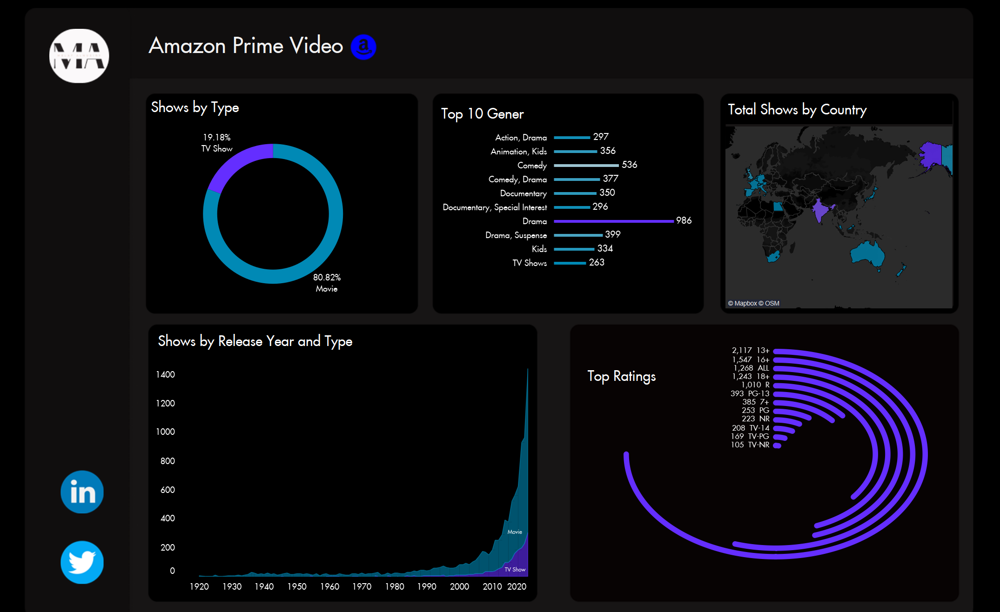

## Amazon Prime Dashboard
This dashboard displays various visualizations of company insights. 

It demonstrates the following insights in particular: 
•     Which language movies are found more in Amazon Prime videos. 
•     Top movies by IMDB rating. 
•     Distribution of movies and TV shows. 
•     Highest release of movies based on years. 
•     Count of movies based on timing. 
•     Distribution of movies as per maturity. 

**Through this project, I've gained valuable experience in data analysis and visualization techniques** 

## Dashboard: 

  
 

**Link to the dataset on kaggle:** https://www.kaggle.com/datasets/shivamb/amazon-prime-movies-and-tv-shows
